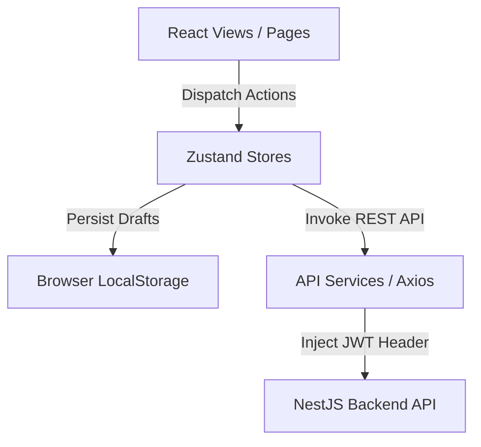

# Aljunaid Admin Dashboard

<div align="center">
  
  <h3>لوحة تحكم منصة الجُنيد التعليمية</h3>
  <p>The enterprise content management system and administrative console for the Aljunaid Educational Platform.</p>

  [](#)
  [](#)
  [](#)
  [](#)
  [](#)
  [](#)
  [](#)
</div>

---

## Overview

**Aljunaid Admin Dashboard** is a production-grade, responsive administrative console built with React 19, TypeScript, and Tailwind CSS. It serves as the primary Content Management System (CMS) for the Aljunaid Educational Platform, allowing administrators to structure courses, build lessons, attach media files/markdown notes, design quizzes, and publish educational modules.

### Business Value
*   **Structured Content Lifecycle:** Moves materials from local drafts to live publication via an auditable checklist workflow.
*   **Interactive Exam Builder:** Supports creating multi-format quizzes with live markdown rendering for mathematical equations and code formatting.
*   **Consolidated Progress Analytics:** Provides high-level visibility into curriculum status, flagging incomplete lessons or missing exams.

---

## Features

### 🔐 Authentication & Authorization
*   **JWT-Based Authentication:** Secure session creation with persistent local session storage.
*   **Role-Based Access Control:** Restricts dashboard entry to `admin` profiles. Automatic logouts and redirects occur if users with student/teacher roles attempt to access the dashboard.
*   **Session Guard Interceptors:** Intercepts 401 Unauthorized errors to automatically revoke local credentials and redirect to the login portal.

### 📚 Curriculum & Course Management
*   **Course Structuring:** Create and update courses with detailed titles, descriptions, and thumbnail uploads.
*   **Nested Modules:** Group materials within courses using sequential modules with custom orders.
*   **Lesson Planning:** Manage individual lessons, order rankings, and publication indicators.

### 📝 Rich Content Management
*   **Video Integration:** Attach video URLs directly to lessons.
*   **PDF Support:** Link study materials and PDFs to lectures.
*   **Markdown Editor:** In-lesson markdown editor with full text structuring capabilities.

### 📝 Quiz Builder & Exam Management
*   **Multiple Question Types:** Supports Multiple Choice Questions (MCQ), True/False, and Short Answer question types.
*   **Markdown Question Editor:** Rich question input fields utilizing KaTeX for rendering mathematical equations and PrismJS for syntax highlighting.
*   **Image Attachments:** Link illustrative images to specific questions.

### 🚀 Publication Workflow
*   **Local Storage Drafts:** Unsaved course modules, lessons, and content items are stored in persistent local drafts so work is never lost.
*   **Technical Audit Checklists:** Visual checklists indicating the completeness of lessons (requires title, description, attached content, and linked exams) before publishing.
*   **Batch Publishing Wizard:** Publish draft units in bulk to the NestJS backend API.

---

## Screenshots

<div align="center">
  <table>
    <tr>
      <td width="50%">
        <p align="center"><b>Login Screen</b></p>
        
      </td>
      <td width="50%">
        <p align="center"><b>Dashboard Analytics</b></p>
        
      </td>
    </tr>
    <tr>
      <td width="50%">
        <p align="center"><b>Course Catalog</b></p>
        
      </td>
      <td width="50%">
        <p align="center"><b>Quiz Builder</b></p>
        
      </td>
    </tr>
  </table>
</div>

---

## Technology Stack

| Layer | Technology | Description |
| :--- | :--- | :--- |
| **Frontend Framework** | React 19.2 | High-performance UI rendering using hooks. |
| **Language** | TypeScript 5.9 | Type-safe development with strict type definitions. |
| **Styling** | Tailwind CSS 4.1 | Utility-first styling with responsive, RTL Arabic typography. |
| **Routing** | React Router 7.1 | Declarative client-side routing. |
| **State Management** | Zustand 5.0 | Lightweight global state with localStorage persistent middleware. |
| **HTTP Client** | Axios 1.16 | Promise-based request execution with token injection interceptors. |
| **Build System** | Vite 6.3 | Fast build tool and module bundler. |
| **Mobile Integration** | Capacitor 8.4 | Cross-platform bridge wrapper for Android deployment. |
| **Text Rendering** | React Markdown, rehype-sanitize, KaTeX | Secure, mathematical-grade markdown parser. |
| **Testing** | Playwright Test | Automated end-to-end user path testing. |

---

## Project Structure

```text
aljunaid-admin-dashboard/
├── android/                 # Capacitor Android native configuration
├── src/
│   ├── assets/              # Static local asset resources
│   ├── components/          # Reusable UI primitives (dialogs, tables, loaders)
│   ├── hooks/               # Custom React hooks (e.g. data synchronization)
│   ├── lib/                 # Core utilities (axios client configuration)
│   ├── modules/             # Feature modules (Domain-driven directory design)
│   │   ├── auth/            # Auth pages and layout views
│   │   ├── contents/        # Lesson materials and content inputs
│   │   ├── courses/         # Course details and modules settings
│   │   ├── dashboard/       # Main home counters and progress indicators
│   │   ├── lessons/         # Lesson builders and listings
│   │   ├── publish/         # Publisher checklists and wizards
│   │   └── quizzes/         # Exam editors, custom markdown components
│   ├── routes/              # Client-side routing definitions
│   ├── services/            # Backend API adaptor services
│   ├── store/               # Zustand global state stores
│   ├── styles/              # Global css stylesheets (fonts, themes)
│   ├── types/               # TypeScript interface configurations
│   └── utils/               # Formatting helper utilities
├── tests/                   # Playwright E2E spec suites
├── capacitor.config.json    # Mobile app bundle configuration
├── vite.config.ts           # Bundler and custom plugin setup
└── package.json             # Core dependency settings
```

---

## Installation

### 1. Prerequisites
Ensure you have **Node.js** (v18 or higher) and **npm** installed.

### 2. Setup
```bash
# Clone the repository
git clone https://github.com/your-org/aljunaid-admin-dashboard.git
cd aljunaid-admin-dashboard

# Install project dependencies
npm install
```

### 3. Environment Setup
Create a `.env` file in the root directory:
```env
VITE_API_URL=https://algonaid-api.onrender.com/api/v1
```

### 4. Running Locally
```bash
# Start the development server
npm run dev

# Run Playwright end-to-end tests
npx playwright test
```

### 5. Compiling Builds
```bash
# Generate optimized production bundle
npm run build

# Preview production build locally
npm run preview
```

---

## Environment Variables

| Variable | Required | Description | Default |
| :--- | :---: | :--- | :--- |
| `VITE_API_URL` | Yes | Root endpoint URL for backend NestJS REST API | `https://algonaid-api.onrender.com/api/v1` |

---

## Available Scripts

*   `npm run dev`: Fires up the local Vite development server with Hot Module Replacement (HMR).
*   `npm run build`: Bundles the application using TypeScript compiler and Vite, generating static production assets in the `dist/` directory.
*   `npm run preview`: Launches a local server to preview the generated production files in `dist/`.

---

## Application Architecture



### Module Organization
The code follows a **Domain-Driven Module Pattern** under `src/modules`. Each domain (e.g. `quizzes`, `publish`) encapsulates its unique screens and local sub-components, while global utilities (e.g., layouts, api hooks) are shared via root directories.

### Data Flow
1.  **Draft State:** User creates curriculum changes. Changes are updated in Zustand stores (`courses.store.ts`, `lessons.store.ts`) and cached in LocalStorage.
2.  **Publish Trigger:** On clicking "Publish", the wizard iterates through the local stores.
3.  **API Services:** Services (`lessons.api.ts`, `exams.api.ts`) map models and issue Axios calls to NestJS.
4.  **State Sync:** Successfully saved elements are removed from local draft storage and cached in backend states.

---

## Security

*   **JWT Token Protection:** Access tokens are attached to every request automatically using Axios interceptors.
*   **Client Route Protection:** The `ProtectedRoute` component inspects the active token and enforces that the user's role matches `admin` before rendering layout paths.
*   **Session Termination Interceptor:** Automatically clears token storage and redirects the browser on receiving any 401 Unauthorized API responses.

---

## Responsive Design

The application layout uses an adaptive design system built on custom Tailwind styles:
*   **Desktop:** Sidebar navigation panel with grid views and expandable tables.
*   **Tablet & Mobile:** Hamburger menu overlay, collapsible cards, and touch-friendly buttons.

---

## Performance

*   **Code Splitting:** Page components are loaded asynchronously using React's `lazy` and `Suspense` loaders.
*   **State Memoization:** Heavy calculations (e.g. tracking progress counters across all lessons) are cached locally using `useMemo` hooks.
*   **Zustand Persistence:** Limits unnecessary network requests by caching drafts locally.

---

## Accessibility

*   **Accessible Components:** Uses Radix UI primitives (`@radix-ui/react-dialog`, `@radix-ui/react-tabs`) which provide out-of-the-box keyboard navigation, focus trap handling, and appropriate ARIA roles.
*   **Cairo Font Hierarchy:** Styled using font configurations optimised for Arabic RTL reading comfort.

---

## Deployment

The application is configured to deploy to Vercel via static route rewriting. 

### Manual Vercel Deployment
```bash
# Install Vercel CLI
npm install -g vercel

# Deploy the project
vercel
```

---

## Contributing

1.  Create a feature branch from `main` (`git checkout -b feature/your-feature`).
2.  Format your code and run linters before committing.
3.  Ensure all Playwright specs pass (`npx playwright test`).
4.  Open a Pull Request with description of changes.

---

## Code Style

*   **TypeScript:** Strictly typed. Avoid using `any` types.
*   **CSS:** Use Tailwind CSS utility classes. Avoid inline style overrides.
*   **Directory Structure:** Put page files in the corresponding `src/modules/*/pages` directory.

---

## Known Limitations

*   **N+1 Request Cascade:** Fetching lessons requires running parallel requests per module on the client side.
*   **Lack of Publish Rollback:** Interrupted publishing wizard calls leave partial resources created in the backend.
*   **No Admin-Side User Administration:** User and role management is not supported inside the dashboard UI.
*   **String MCQ Option Matches:** Multiple choice correct answer selections are tied directly to option text strings rather than unique indices.

---

## License

Private and Proprietary. All rights reserved.

---

## Author

**Aljunaid Educational Platform Team**  
*Contact: support@aljunaid.edu*

---

<div align="center">
  <p>© 2026 Aljunaid Educational Platform. All rights reserved.</p>
</div>
